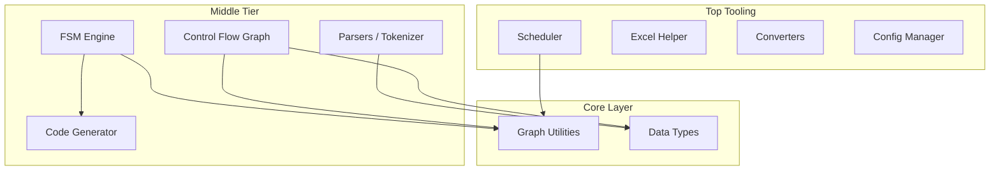

# MyPkg — Module Roadmap

[](roadmap.md)
[](roadmap_zh.md)

> Goal: Create a personal general-purpose toolkit to enable fast import and development for future scripts/compilers/automation tools.

---

## Currently Completed

| Module | Purpose |
|------|------|
| `MapBV` | Bit-vector mapping and access |
| `NumBV` | Numeric bit-vector arithmetic |
| `Scheduler` | Job scheduling (CmdJob / GridJob) |

---

## Proposed Modules Detailed Specs

### 1. Enhanced Data Types (`mypkg/data_types/`)

#### Problem
Python's built-in `dict` and `list` lack common safety checks. For example, when accidentally defining the same address twice in a register map, a `dict` silently overwrites it instead of raising an error.

#### Details

```python
from mypkg import UniqueDict, FrozenDict, TypedList, IndexedList

# --- UniqueDict: Prohibits overwriting existing keys ---
reg_map = UniqueDict()
reg_map["CTRL"] = 0x00
reg_map["CTRL"] = 0x04  # ← raises DuplicateKeyError("CTRL already exists")

# Optional modes:
reg_map = UniqueDict(on_duplicate="warn")       # Only warn, no raise
reg_map = UniqueDict(on_duplicate="overwrite")  # Degrades to standard dict

# --- FrozenDict: Immutable dict (hashable, can be used as dict keys) ---
config = FrozenDict({"width": 8, "signed": True})
cache[config] = result  # ← Standard dict fails, FrozenDict works

# --- TypedList: Restricts element types ---
jobs = TypedList(Job)
jobs.append(CmdJob("a", cmd="echo"))  # ✅ CmdJob is subclass of Job
jobs.append("not a job")              # ← raises TypeError

# --- IndexedList: Fetch elements by name or index ---
signals = IndexedList(key=lambda s: s.name)
signals.append(Signal("clk"))
signals["clk"]   # ← Signal("clk")
signals[0]       # ← Signal("clk")
```

#### Use Cases
- Prevent duplicate assignments when defining register maps
- Immutable structures for configs
- Job/signal lists needing by-name lookup

---

### 2. FSM Engine (`mypkg/fsm/`)

#### Problem
NCTL is essentially a programmable FSM. Currently, your FSM logic is likely scattered across `if-else` blocks. There lacks a unified approach to **define, validate, visualize, and execute** an FSM.

#### Details

```python
from mypkg import FSM, State, Transition

# --- Define FSM ---
fsm = FSM("uart_rx")
fsm.add_states("IDLE", "START", "DATA", "STOP", "ERROR")

fsm.add_transition("IDLE",  "START", event="rx_low",    action="reset_counter")
fsm.add_transition("START", "DATA",  event="half_bit",  action="sample_bit")
fsm.add_transition("DATA",  "DATA",  event="bit_done",  action="shift_in", guard="bit_count < 8")
fsm.add_transition("DATA",  "STOP",  event="bit_done",  guard="bit_count == 8")
fsm.add_transition("STOP",  "IDLE",  event="rx_high",   action="output_byte")
fsm.add_transition("STOP",  "ERROR", event="rx_low")

# --- Validate ---
fsm.validate()
# Checks: unreachable states? deadlocks (no outgoing transitions)?

# --- Visualize ---
fsm.to_mermaid()    # Export mermaid syntax (paste to markdown)
fsm.to_dot()        # Export graphviz dot (generate PNG/SVG)
fsm.to_table()      # Export state transition table (Text or Markdown)

# --- Simulate Execution ---
fsm.reset()                         # → IDLE
fsm.step("rx_low")                  # → START, runs reset_counter
fsm.step("half_bit")                # → DATA, runs sample_bit
print(fsm.current_state)            # "DATA"
print(fsm.history)                  # [("IDLE","rx_low","START"), ...]

# --- Export (For future NCTL backend) ---
fsm.to_asm(backend="nctl")          # Direct NCTL assembly generation
fsm.to_json()                       # Export as JSON, readable by Draw.io plugin
```

#### Use Cases
- **NCTL**: Direct assembly generation from FSM definitions
- **UC**: Parser's lexer can use FSM to describe token matching
- **Verification**: Ensure FSM has no deadlocks or unreachable states
- **Future (a)**: Flowcharts drawn in Draw.io → import to FSM → generate ASM

---

### 3. Control Flow Graph (`mypkg/cfg/`)

#### Problem
The UC compiler needs a CFG to perform optimizations (dead code elimination, loop detection). Currently, no general-purpose CFG tool exists, requiring a scratch build every time.

#### Details

```python
from mypkg.cfg import CFG, BasicBlock

# --- Build CFG ---
cfg = CFG()
entry = cfg.add_block("entry", instructions=["MOV A, #0", "CJNE A, #10, L1"])
bb1   = cfg.add_block("bb1",   instructions=["ADD A, #5", "SJMP L_END"])
bb2   = cfg.add_block("bb2",   instructions=["MOV A, #0"])
end   = cfg.add_block("end",   instructions=["NOP"])

cfg.add_edge("entry", "bb1", label="A != 10")
cfg.add_edge("entry", "bb2", label="A == 10")
cfg.add_edge("bb1", "end")
cfg.add_edge("bb2", "end")

# --- Analysis ---
cfg.dominators()           # Dominator Tree
cfg.post_dominators()      # Post-Dominator Tree
cfg.find_loops()           # Detect natural loops
cfg.find_dead_blocks()     # Detect unreachable blocks

# --- Visualization ---
cfg.to_mermaid()           # Flowchart syntax
cfg.to_dot()               # Graphviz

# --- Traversal ---
for block in cfg.dfs():          # Depth-First
    ...
for block in cfg.bfs():          # Breadth-First
for block in cfg.reverse_postorder():  # Reverse Post-Order (for dataflow analysis)
```

#### Use Cases
- **UC compiler backend**: IR → CFG → Optimize → ASM
- **NCTL**: Analyze program flow; detect infinite loops
- **Debug**: Visualize control flows generated by compiler

---

### 4. Graph Utilities (`mypkg/graph/`)

#### Problem
The Scheduler already handles DAG dependency resolution, the CFG requires graph algorithms, and the FSM is inherently a graph. These underlying operations should be abstracted out and shared.

#### Details

```python
from mypkg.graph import DiGraph, toposort, find_cycles, shortest_path

# --- Universal Directed Graph ---
g = DiGraph()
g.add_node("A", data={"type": "start"})
g.add_node("B")
g.add_edge("A", "B", weight=1)

# --- Algorithms ---
toposort(g)           # Topological sort (Used by Scheduler)
find_cycles(g)        # Cycle detection (dependency check)
g.ancestors("B")      # All ancestors of B
g.descendants("A")    # All descendants of A
g.is_dag()            # Is it a DAG?

# --- Internally shared by FSM / CFG / Scheduler ---
# Output state graph of FSM is a DiGraph
# Output block graph of CFG is a DiGraph
# Dependency chart of Scheduler is a DiGraph
```

#### Use Cases
- Act as shared underlying engine for **FSM**, **CFG**, and **Scheduler**
- Independent usage: dependency analysis, circuit netlist traversal

---

### 5. Tokenizer Base (`mypkg/parsers/`)

#### Problem
Your UC and NCTL tokenizers are separate. But 90% of the logic is identical:
- Skip whitespaces/comments
- Identify numbers (`0x1A`, `#10`, `0b1010`)
- Identify strings (`"hello"`)
- Identify identifiers (`MOV`, `R0`, `label_name`)
- Track line/col location (for errors)
- Produce token stream

**Differences only reside in the token definitions and special grammar rules** (e.g., UC has `${}` inline asm, NCTL does not).

#### Details

```python
from mypkg.parsers import Lexer, token, TokenStream

# --- Define Token Typs ---
class UCLexer(Lexer):
    """Tokenizer for UC DSL — Just define patterns"""

    # Using decorators to define rules (Priority = Defined order)
    @token(r"0x[0-9a-fA-F]+")
    def HEX(self, value):
        return int(value, 16)

    @token(r"0b[01]+")
    def BIN(self, value):
        return int(value, 2)

    @token(r"\d+")
    def INT(self, value):
        return int(value)

    @token(r"if|else|while|for|return")
    def KEYWORD(self, value):
        return value

    @token(r"[a-zA-Z_]\w*")
    def IDENT(self, value):
        return value

    @token(r"\$\{.*?\}")
    def INLINE_ASM(self, value):
        return value[2:-1]  # Strip ${ }

    # Auto handles: spaces, // and /* */ comments, line tracking

# --- Usage ---
lexer = UCLexer()
tokens = lexer.tokenize("if (x > 0x1A) { y = x + 1 }")
# → [KEYWORD("if"), LPAREN, IDENT("x"), GT, HEX(26), RPAREN, ...]

for tok in tokens:
    print(f"{tok.type:10} {tok.value!r:15} line {tok.line}")

# --- NCTL Version: Barely needs to alter token rules ---
class NCTLLexer(Lexer):
    @token(r"MOV|ADD|SUB|JMP|NOP|HALT")
    def INSTRUCTION(self, value): return value

    @token(r"R[0-7]")
    def REGISTER(self, value): return value

    @token(r"[a-zA-Z_]\w*:")
    def LABEL(self, value): return value.rstrip(":")
```

#### Added Features

```python
# --- TokenStream: Tream with peek/expect behavior ---
stream = TokenStream(tokens)
stream.peek()                    # Look ahead (won't consume)
stream.expect("KEYWORD", "if")  # Expect if, else raise SyntaxError
stream.match("LPAREN")          # Match, returns True & consumes on success

# --- Auto line/col mapped errors ---
# SyntaxError: line 5, col 12: expected ')', got 'EOF'
```

#### Use Cases
- **UC compiler**: Just define UC patterns. Base class does the rest.
- **NCTL compiler**: Same approach, different patterns.
- **Verilog parser**: Re-usability applies here.
- **Future Langs**: A new tokenizer takes 10 mins.

---

### 6. Template Engine / Code Generator (`mypkg/codegen/`)

#### Problem
UC and NCTL backends both need to convert IR into text ASM. Right now strings/f-strings might be in use, but alignment, indents, and comment formatting rapidly turn into a mess.

#### Details

```python
from mypkg.codegen import AsmEmitter, CodeTemplate

# --- AsmEmitter: Standardized ASM text writer ---
emit = AsmEmitter(indent="    ", comment_prefix=";")

emit.label("MAIN")
emit.inst("MOV", "A", "#0x00")         # Auto aligns
emit.inst("CJNE", "A", "#10", "L1")
emit.comment("--- branch ---")
emit.label("L1")
emit.inst("ADD", "A", "#5")
emit.blank()                            # Empty line
emit.inst("SJMP", "END")
emit.label("END")
emit.inst("NOP")

print(emit.build())
# Output:
# MAIN:
#     MOV  A, #0x00        ; 
#     CJNE A, #10, L1      ; 
#     ; --- branch ---
# L1:
#     ADD  A, #5           ; 
#
#     SJMP END             ; 
# END:
#     NOP                  ; 

# --- CodeTemplate: Text generation based on Handlebars/Liquid ---
tmpl = CodeTemplate("""
; === Generated for {{name}} ===
; Date: {{date}}
{{#each instructions}}
    {{mnemonic}} {{operands|join(", ")}}
{{/each}}
""")

output = tmpl.render(
    name="uart_tx",
    date="2026-02-18",
    instructions=[
        {"mnemonic": "MOV", "operands": ["A", "#0x55"]},
        {"mnemonic": "MOV", "SBUF", "A"},
    ],
)
```

#### Use Cases
- **UC backend**: Output of register allocator → neatly formatted `.asm` file
- **NCTL backend**: Formatting logic from FSM states to ASM text
- **Verilog gen**: RTL coding tools support
- **Reports**: Auto generation for test result markdowns

---

### 7. Parsing Helpers (`mypkg/parsers/`)

#### Problem
Parsing diverse text files is an everyday task: Verilog signal lists, log analysis, synth reports. Writing fresh RegExp every time is tedious.

#### Details

```python
from mypkg.parsers import (
    verilog_ports,        # Verilog module port parser
    verilog_signals,      # Verilog reg/wire parser
    parse_table,          # Text-based table parser
    LogParser,            # Structured log analysis
)

# --- Verilog Port Parser ---
ports = verilog_ports("""
module top (
    input        clk,
    input        rst_n,
    output [7:0] data_out,
    inout        data_bus
);
""")
# → [Port("clk", "input", 1), Port("data_out", "output", 8), ...]

# --- Table Text Parser ---
rows = parse_table("""
Name        Width  Direction
clk         1      input
data_out    8      output
addr        16     input
""")
# → [{"Name":"clk", "Width":"1", "Direction":"input"}, ...]

# --- Log Parser (pattern-based) ---
parser = LogParser()
parser.add_pattern("error",   r"^ERROR:\s*(.+)")
parser.add_pattern("warning", r"^WARNING:\s*(.+)")
parser.add_pattern("timing",  r"Slack\s*:\s*([\d.]+)ns")

results = parser.parse_file("synthesis.log")
results.errors      # All line matches for ERROR
results.warnings    # All line matches for WARNING
results.get("timing")  # Retrieves all timing slack captures
```

#### Use Cases
- Grab RTL specification signal lists
- Simulation or Synthesis log error sweeping
- Automation scripts over parsed reports

---

### 8. Excel Helper (`mypkg/excel/`)

#### Problem
Many specs exist as Excel files, but using `openpyxl`'s native row/col loop iterations is overly granular for quick scripts.

#### Details

```python
from mypkg.excel import ExcelReader, ExcelWriter

# --- Mode 1: By Header (Most typical) ---
reader = ExcelReader("regmap.xlsx", sheet="Registers")
for row in reader.by_header():
    print(row["Name"], row["Address"], row["Width"])
# Uses first valid row as header dictionary keys

# --- Mode 2: By Region ---
data = reader.region("B3:F20")  # Yields 2D list of cells

# --- Mode 3: By Pattern-Regex Search ---
matches = reader.find("Address", pattern=r"0x[0-9A-F]+")
# → Iterates everything under "Address", returns values matching Hex formats

# --- Mode 4: Sheet Merge ---
all_regs = reader.merge_sheets(["Sheet1", "Sheet2"], key="Name")

# --- Export/Writer ---
writer = ExcelWriter("output.xlsx")
writer.from_dicts(data, sheet="result")
writer.from_table(headers, rows, sheet="raw")
writer.save()
```

---

### 9. Converters (`mypkg/converters/`)

#### Problem
File format conversions are a persistent demand stringing scripts together.

#### Details

```python
from mypkg.converters import (
    excel_to_json,
    json_to_excel,
    csv_to_dict,
    stitch_images,       # PNG image stitcher
    dict_to_markdown,    # dict → MD table
)

# --- Excel ↔ JSON ---
excel_to_json("regmap.xlsx", "regmap.json", sheet="Registers")
json_to_excel("data.json", "output.xlsx")

# --- Screenshots/Waveform stitcher ---
stitch_images(
    ["wave1.png", "wave2.png", "wave3.png"],
    output="combined.png",
    direction="vertical",    # Or horizontally
    gap=10,                  # Margin between shots
)

# --- Dict → Markdown Table ---
print(dict_to_markdown([
    {"Name": "clk", "Width": 1},
    {"Name": "data", "Width": 8},
]))
# | Name | Width |
# |------|-------|
# | clk  | 1     |
# | data | 8     |
```

---

### 10. Config Manager (`mypkg/config/`)

#### Problem
Tooling heavily requires JSON/YAML configuration input, but handling verification schemas, default fallback variables, and nested checks bloats code.

#### Details

```python
from mypkg.config import Config

# --- Schema Enforcer ---
cfg = Config.load("project.yaml", schema={
    "parallel":    {"type": int,  "default": 4,    "min": 1},
    "log_dir":     {"type": str,  "default": "./logs"},
    "grid.queue":  {"type": str,  "default": "normal"},
    "grid.slots":  {"type": int,  "default": 1},
    "timeout":     {"type": float, "default": None, "nullable": True},
})

cfg.parallel     # Reads from YAML or falls back 
cfg.grid.queue   # Supports dot-path nested object fetches
cfg.to_dict()    # Raw pure extraction

# --- Environ Variables Override ---
# Pre-set with: MYPKG_PARALLEL=8 → effectively runs cfg.parallel == 8
```

---

## Inter-Module Dependency Relationships



---

## Suggested Priority Rollout

| Priority | Module | Description/Reason |
|--------|------|------|
| 🔴 P0 | **Graph Utilities** | Root layer for FSM, CFG, and Scheduler dependencies |
| 🔴 P0 | **Data Types** | Highly fundamental; heavily reusable module-wide |
| 🔴 P1 | **FSM Engine** | NCTL relies on this explicitly |
| 🔴 P1 | **Parsers / Tokenizer** | Central UC and NCTL framework component |
| 🟡 P2 | **CFG** | Required for UC tree optimizations |
| 🟡 P2 | **Code Generator** | Unified engine for compilers exporting text |
| 🟢 P3 | **Excel Helper** | Productivity multiplier |
| 🟢 P3 | **Converters** | Standalone automation glue |
| 🟢 P3 | **Parsing Helpers** | Standalone productivity functions |
| 🟢 P3 | **Config Manager** | Nice-to-have boilerplate remover |
