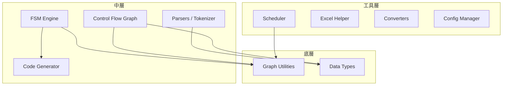

# MyPkg — 模組路線圖

[](roadmap.md)
[](roadmap_zh.md)

> 目標：建立個人通用工具包，讓未來建構 script / compiler / 自動化工具時可以快速 import 開發。

---

## 目前已完成

| 模組 | 用途 |
|------|------|
| `MapBV` | Bit-vector 映射與存取 |
| `NumBV` | 數值型 bit-vector 運算 |
| `Scheduler` | Job 排程 (CmdJob) |

---

## 提案模組詳細說明

### 1. 增強 Data Types (`mypkg/data_types/`)

#### 問題
Python 內建的 `dict`, `list` 缺乏常見的安全檢查。例如在 register map 中不小心重複定義同一個 address，dict 不會報錯，直接覆蓋。

#### 具體內容

```python
from mypkg import UniqueDict, FrozenDict, TypedList, IndexedList

# --- UniqueDict: 禁止覆蓋已存在的 key ---
reg_map = UniqueDict()
reg_map["CTRL"] = 0x00
reg_map["CTRL"] = 0x04  # ← raise DuplicateKeyError("CTRL already exists")

# 可選 mode：
reg_map = UniqueDict(on_duplicate="warn")   # 只 warning，不 raise
reg_map = UniqueDict(on_duplicate="overwrite")  # 退化成普通 dict

# --- FrozenDict: 不可變 dict (hashable, 可當 dict key) ---
config = FrozenDict({"width": 8, "signed": True})
cache[config] = result  # ← 普通 dict 不行，FrozenDict 可以

# --- TypedList: 限制元素型別 ---
jobs = TypedList(Job)
jobs.append(CmdJob("a", cmd="echo"))  # ✅ CmdJob 是 Job 子類
jobs.append("not a job")              # ← raise TypeError

# --- IndexedList: 可以用 name 或 index 取元素 ---
signals = IndexedList(key=lambda s: s.name)
signals.append(Signal("clk"))
signals["clk"]   # ← Signal("clk")
signals[0]       # ← Signal("clk")
```

#### 你的 use case
- Register map 定義時防止重複 assign
- Config 相關的 immutable 結構
- Job list / signal list 需要 by-name 查詢

---

### 2. FSM Engine (`mypkg/fsm/`)

#### 問題
NCTL 本質是 programmable FSM，你目前寫 FSM 邏輯時可能是散落在各處的 if-else。沒有一個統一的方式去**定義、驗證、視覺化、執行**一個 FSM。

#### 具體內容

```python
from mypkg import FSM, State, Transition

# --- 定義 FSM ---
fsm = FSM("uart_rx")
fsm.add_states("IDLE", "START", "DATA", "STOP", "ERROR")

fsm.add_transition("IDLE",  "START", event="rx_low",    action="reset_counter")
fsm.add_transition("START", "DATA",  event="half_bit",  action="sample_bit")
fsm.add_transition("DATA",  "DATA",  event="bit_done",  action="shift_in", guard="bit_count < 8")
fsm.add_transition("DATA",  "STOP",  event="bit_done",  guard="bit_count == 8")
fsm.add_transition("STOP",  "IDLE",  event="rx_high",   action="output_byte")
fsm.add_transition("STOP",  "ERROR", event="rx_low")

# --- 驗證 ---
fsm.validate()
# 檢查: 是否有 unreachable state? 是否有 deadlock (沒有出去的 transition)?

# --- 視覺化 ---
fsm.to_mermaid()    # 輸出 mermaid 語法，可貼到 markdown
fsm.to_dot()        # 輸出 graphviz dot，可產生 PNG/SVG
fsm.to_table()      # 輸出 state transition table (文字或 markdown)

# --- 模擬執行 ---
fsm.reset()                         # → IDLE
fsm.step("rx_low")                  # → START, 執行 reset_counter
fsm.step("half_bit")                # → DATA,  執行 sample_bit
print(fsm.current_state)            # "DATA"
print(fsm.history)                  # [("IDLE","rx_low","START"), ...]

# --- 匯出 (未來用於 NCTL) ---
fsm.to_asm(backend="nctl")          # 直接產生 NCTL assembly
fsm.to_json()                       # 匯出為 JSON，可被 Draw.io plugin 讀取
```

#### 你的 use case
- **NCTL**：直接從 FSM 定義產生 assembly
- **UC**：parser 的 lexer 可以用 FSM 描述 token 識別
- **驗證**：確保 FSM 沒有 deadlock / unreachable state
- **未來 (a)**：Draw.io 畫的流程圖 → 匯入 FSM → 產生 ASM

---

### 3. Control Flow Graph (`mypkg/cfg/`)

#### 問題
UC compiler 需要 CFG 來做優化（dead code elimination, loop detection）。目前沒有通用的 CFG 工具，每次都要自己從頭寫。

#### 具體內容

```python
from mypkg.cfg import CFG, BasicBlock

# --- 建構 CFG ---
cfg = CFG()
entry = cfg.add_block("entry", instructions=["MOV A, #0", "CJNE A, #10, L1"])
bb1   = cfg.add_block("bb1",   instructions=["ADD A, #5", "SJMP L_END"])
bb2   = cfg.add_block("bb2",   instructions=["MOV A, #0"])
end   = cfg.add_block("end",   instructions=["NOP"])

cfg.add_edge("entry", "bb1", label="A != 10")
cfg.add_edge("entry", "bb2", label="A == 10")
cfg.add_edge("bb1", "end")
cfg.add_edge("bb2", "end")

# --- 分析 ---
cfg.dominators()           # 支配樹 (Dominator Tree)
cfg.post_dominators()      # 後支配樹
cfg.find_loops()           # 偵測自然迴圈 (natural loops)
cfg.find_dead_blocks()     # 找出 unreachable blocks

# --- 視覺化 ---
cfg.to_mermaid()           # flowchart 語法
cfg.to_dot()               # graphviz

# --- 遍歷 ---
for block in cfg.dfs():          # 深度優先
    ...
for block in cfg.bfs():          # 廣度優先
for block in cfg.reverse_postorder():  # 反向後序 (dataflow analysis 用)
```

#### 你的 use case
- **UC compiler backend**：IR → CFG → 優化 → ASM
- **NCTL**：分析程式流程，偵測無窮迴圈
- **Debug**：視覺化 compiler 產出的 control flow

---

### 4. Graph Utilities (`mypkg/graph/`)

#### 問題
Scheduler 已經有 DAG 依賴解析，CFG 需要圖演算法，FSM 也是圖。這些底層圖操作應該抽出來共用。

#### 具體內容

```python
from mypkg.graph import DiGraph, toposort, find_cycles, shortest_path

# --- 通用有向圖 ---
g = DiGraph()
g.add_node("A", data={"type": "start"})
g.add_node("B")
g.add_edge("A", "B", weight=1)

# --- 演算法 ---
toposort(g)           # 拓撲排序 (Scheduler 用)
find_cycles(g)        # 環偵測 (dependency 用)
g.ancestors("B")      # B 的所有祖先節點
g.descendants("A")    # A 的所有後代節點
g.is_dag()            # 是否為 DAG

# --- 內部被 FSM / CFG / Scheduler 共用 ---
# FSM 的 state graph 就是 DiGraph
# CFG 的 block graph 就是 DiGraph
# Scheduler 的 dependency 就是 DiGraph
```

#### 你的 use case
- 作為 **FSM**, **CFG**, **Scheduler** 的底層引擎
- 獨立使用：dependency 分析、circuit netlist 遍歷

---

### 5. Tokenizer Base (`mypkg/parsers/`)

#### 問題
你的 UC tokenizer 和 NCTL tokenizer 是分開寫的。但其實 90% 的邏輯是一樣的：
- 跳過空白和註解
- 識別數字 (`0x1A`, `#10`, `0b1010`)
- 識別字串 (`"hello"`)
- 識別識別符 (`MOV`, `R0`, `label_name`)
- 記錄行號和位置（用於錯誤訊息）
- 產生 Token stream

**差異只在「Token 的種類」和「特殊語法」**（例如 UC 有 `${}` inline asm，NCTL 沒有）。

#### 具體內容

```python
from mypkg.parsers import Lexer, token, TokenStream

# --- 定義你的 Token 種類 ---
class UCLexer(Lexer):
    """UC DSL 的 Tokenizer — 只需定義 token patterns"""

    # 用 decorator 定義 token rule（優先度 = 定義順序）
    @token(r"0x[0-9a-fA-F]+")
    def HEX(self, value):
        return int(value, 16)

    @token(r"0b[01]+")
    def BIN(self, value):
        return int(value, 2)

    @token(r"\d+")
    def INT(self, value):
        return int(value)

    @token(r"if|else|while|for|return")
    def KEYWORD(self, value):
        return value

    @token(r"[a-zA-Z_]\w*")
    def IDENT(self, value):
        return value

    @token(r"\$\{.*?\}")
    def INLINE_ASM(self, value):
        return value[2:-1]  # 去掉 ${ }

    # 自動處理: 空白跳過、// 和 /* */ 註解、行號追蹤

# --- 使用 ---
lexer = UCLexer()
tokens = lexer.tokenize("if (x > 0x1A) { y = x + 1 }")
# → [KEYWORD("if"), LPAREN, IDENT("x"), GT, HEX(26), RPAREN, ...]

for tok in tokens:
    print(f"{tok.type:10} {tok.value!r:15} line {tok.line}")

# --- NCTL 版本：幾乎只需改 token 定義 ---
class NCTLLexer(Lexer):
    @token(r"MOV|ADD|SUB|JMP|NOP|HALT")
    def INSTRUCTION(self, value): return value

    @token(r"R[0-7]")
    def REGISTER(self, value): return value

    @token(r"[a-zA-Z_]\w*:")
    def LABEL(self, value): return value.rstrip(":")
```

#### 附加功能

```python
# --- TokenStream: 帶 peek/expect 的 token 流 ---
stream = TokenStream(tokens)
stream.peek()                    # 看下一個 token（不消耗）
stream.expect("KEYWORD", "if")  # 預期 if，否則 raise SyntaxError
stream.match("LPAREN")          # 嘗試匹配，成功回傳 True 並消耗

# --- 錯誤訊息自動帶行號 ---
# SyntaxError: line 5, col 12: expected ')', got 'EOF'
```

#### 你的 use case
- **UC compiler**：只需定義 UC 的 token patterns，Lexer 框架處理其餘
- **NCTL compiler**：同上，換 token patterns
- **Verilog parser**：也可以用同樣框架
- **未來新語言**：10 分鐘就能寫出新 tokenizer

---

### 6. Template Engine / Code Generator (`mypkg/codegen/`)

#### 問題
UC 和 NCTL 的後端都需要把 IR 轉成文字 ASM。目前可能用 f-string 或字串拼接，但遇到 indentation、label alignment、comment formatting 時很混亂。

#### 具體內容

```python
from mypkg.codegen import AsmEmitter, CodeTemplate

# --- AsmEmitter: 專為 assembly 設計的 code writer ---
emit = AsmEmitter(indent="    ", comment_prefix=";")

emit.label("MAIN")
emit.inst("MOV", "A", "#0x00")         # 自動 align
emit.inst("CJNE", "A", "#10", "L1")
emit.comment("--- branch ---")
emit.label("L1")
emit.inst("ADD", "A", "#5")
emit.blank()                            # 空行
emit.inst("SJMP", "END")
emit.label("END")
emit.inst("NOP")

print(emit.build())
# 輸出:
# MAIN:
#     MOV  A, #0x00        ; 
#     CJNE A, #10, L1      ; 
#     ; --- branch ---
# L1:
#     ADD  A, #5           ; 
#
#     SJMP END             ; 
# END:
#     NOP                  ; 

# --- CodeTemplate: 模板化代碼生成 ---
tmpl = CodeTemplate("""
; === Generated for {{name}} ===
; Date: {{date}}
{{#each instructions}}
    {{mnemonic}} {{operands|join(", ")}}
{{/each}}
""")

output = tmpl.render(
    name="uart_tx",
    date="2026-02-18",
    instructions=[
        {"mnemonic": "MOV", "operands": ["A", "#0x55"]},
        {"mnemonic": "MOV", "SBUF", "A"},
    ],
)
```

#### 你的 use case
- **UC backend**：Register allocator 的結果 → 整齊的 `.asm` 檔
- **NCTL backend**：FSM → ASM 的輸出格式化
- **Verilog 生成**：RTL code generation
- **報告**：自動產生 test result 的 markdown

---

### 7. Parsing Helpers (`mypkg/parsers/`)

#### 問題
工作中常需要 parse 各種格式：Verilog signal list、simulation log、synthesis report。每次都要寫 regex，很煩。

#### 具體內容

```python
from mypkg.parsers import (
    verilog_ports,        # Verilog module port 解析
    verilog_signals,      # 信號宣告解析
    parse_table,          # 文字表格解析
    LogParser,            # 結構化 log 解析
)

# --- Verilog Port Parser ---
ports = verilog_ports("""
module top (
    input        clk,
    input        rst_n,
    output [7:0] data_out,
    inout        data_bus
);
""")
# → [Port("clk", "input", 1), Port("data_out", "output", 8), ...]

# --- 文字表格解析 ---
rows = parse_table("""
Name        Width  Direction
clk         1      input
data_out    8      output
addr        16     input
""")
# → [{"Name":"clk", "Width":"1", "Direction":"input"}, ...]

# --- Log Parser (pattern-based) ---
parser = LogParser()
parser.add_pattern("error",   r"^ERROR:\s*(.+)")
parser.add_pattern("warning", r"^WARNING:\s*(.+)")
parser.add_pattern("timing",  r"Slack\s*:\s*([\d.]+)ns")

results = parser.parse_file("synthesis.log")
results.errors      # 所有 ERROR 行
results.warnings    # 所有 WARNING 行
results.get("timing")  # 所有 timing slack 值
```

#### 你的 use case
- RTL 設計的 signal list 抓取
- Synthesis / simulation log 分析
- 各種報告的自動化處理

---

### 8. Excel Helper (`mypkg/excel/`)

#### 問題
公司很多規格都在 Excel 裡。每次都要寫 openpyxl 的 row/col 操作，很繁瑣。

#### 具體內容

```python
from mypkg.excel import ExcelReader, ExcelWriter

# --- 模式 1: By Header (最常用) ---
reader = ExcelReader("regmap.xlsx", sheet="Registers")
for row in reader.by_header():
    print(row["Name"], row["Address"], row["Width"])
# 自動用第一行當 header，返回 dict iterator

# --- 模式 2: By Region (指定範圍) ---
data = reader.region("B3:F20")  # 回傳 2D list

# --- 模式 3: By Pattern (搜尋特定 pattern) ---
matches = reader.find("Address", pattern=r"0x[0-9A-F]+")
# → 找出所有 header 名稱含 "Address" 的欄位，值匹配 hex pattern

# --- 模式 4: 多 sheet 合併 ---
all_regs = reader.merge_sheets(["Sheet1", "Sheet2"], key="Name")

# --- 寫入 ---
writer = ExcelWriter("output.xlsx")
writer.from_dicts(data, sheet="result")
writer.from_table(headers, rows, sheet="raw")
writer.save()
```

---

### 9. 轉換器 (`mypkg/converters/`)

#### 問題
各種格式轉換是日常需求，但每次都要寫一次性的 script。

#### 具體內容

```python
from mypkg.converters import (
    excel_to_json,
    json_to_excel,
    csv_to_dict,
    stitch_images,       # PNG 拼接
    dict_to_markdown,    # dict → markdown table
)

# --- Excel ↔ JSON ---
excel_to_json("regmap.xlsx", "regmap.json", sheet="Registers")
json_to_excel("data.json", "output.xlsx")

# --- PNG 拼接 (wave / screenshot 拼接) ---
stitch_images(
    ["wave1.png", "wave2.png", "wave3.png"],
    output="combined.png",
    direction="vertical",    # or "horizontal"
    gap=10,                  # 間距 pixel
)

# --- Dict → Markdown Table ---
print(dict_to_markdown([
    {"Name": "clk", "Width": 1},
    {"Name": "data", "Width": 8},
]))
# | Name | Width |
# |------|-------|
# | clk  | 1     |
# | data | 8     |
```

---

### 10. Config Manager (`mypkg/config/`)

#### 問題
工具通常需要讀取 YAML/JSON config，但缺乏 schema 驗證、default 值、環境覆蓋等機制。

#### 具體內容

```python
from mypkg.config import Config

# --- 定義 schema ---
cfg = Config.load("project.yaml", schema={
    "parallel":    {"type": int,  "default": 4,    "min": 1},
    "log_dir":     {"type": str,  "default": "./logs"},
    "grid.queue":  {"type": str,  "default": "normal"},
    "grid.slots":  {"type": int,  "default": 1},
    "timeout":     {"type": float, "default": None, "nullable": True},
})

cfg.parallel     # 從 YAML 讀或用 default
cfg.grid.queue   # 支援 nested access
cfg.to_dict()    # 完整 config 匯出

# --- 環境變數覆蓋 ---
# MYPKG_PARALLEL=8 → cfg.parallel == 8
```

---

## 模組依賴關係



---

## 建議實作順序

| 優先度 | 模組 | 理由 |
|--------|------|------|
| 🔴 P0 | **Graph Utilities** | FSM, CFG, Scheduler 的共用底層 |
| 🔴 P0 | **Data Types** | 小而有用，幾乎所有模組都受益 |
| 🔴 P1 | **FSM Engine** | NCTL 直接需要，項目 (a) 的核心 |
| 🔴 P1 | **Parsers / Tokenizer** | UC 和 NCTL compiler 共用 |
| 🟡 P2 | **CFG** | UC compiler 優化需要 |
| 🟡 P2 | **Code Generator** | compiler backend 共用 |
| 🟢 P3 | **Excel Helper** | 工作效率，獨立於 compiler |
| 🟢 P3 | **Converters** | 工作效率，獨立於 compiler |
| 🟢 P3 | **Parsing Helpers** | 工作效率，獨立於 compiler |
| 🟢 P3 | **Config Manager** | 小工具，隨時可加 |
